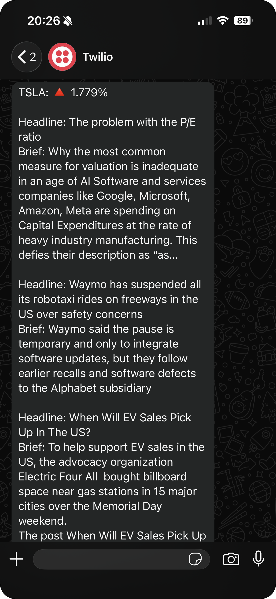

# Stocks News Alert


Stocks News Alert is a Python application that checks recent Tesla stock price
movement and sends related market news as a WhatsApp message.

The application retrieves recent TSLA closing prices from Tiingo, calculates
the percentage change between the latest two closing prices, fetches recent
Tesla news from NewsAPI, and delivers the final alert through Twilio WhatsApp.

## About

This project focuses on a simple market question: did Tesla stock move, and
what recent news might explain the movement?

Instead of showing raw stock and news API responses, it turns the latest price
change and recent articles into a short message with:

- Stock ticker
- Direction indicator for price movement
- Percentage change between the latest two closing prices
- Recent article headlines
- Short article descriptions
- WhatsApp delivery status

## How It Works

1. `main.py` loads API keys and Twilio credentials from the `.env` file.
2. `stocks.py` requests recent TSLA daily prices from Tiingo.
3. `main.py` sorts the returned stock data by date.
4. The application compares the latest closing price with the previous closing
   price.
5. `news.py` requests recent Tesla articles from NewsAPI.
6. `main.py` builds a compact alert message with the price change and top
   articles.
7. Twilio sends the generated alert as a WhatsApp message.

## Features

- Tesla stock price tracking
- Recent closing price comparison
- Percentage change calculation
- Tesla news retrieval through NewsAPI
- WhatsApp delivery through Twilio
- Environment-based secret management with `python-dotenv`

## Preview

<p align="center">
  
</p>

## Getting Started

### Prerequisites

- Python 3
- Tiingo API token
- NewsAPI key
- Twilio account credentials with WhatsApp messaging configured
- A WhatsApp recipient number configured in `main.py`

### Installation

Clone the repository and open the project directory:

```bash
git clone https://github.com/your-username/stocks-news-alert.git
cd stocks-news-alert
```

Create and activate a virtual environment:

```bash
python3 -m venv .venv
source .venv/bin/activate
```

Install dependencies:

```bash
pip install -r requirements.txt
```

## Configuration

Create a `.env` file in the project root:

```env
STOCKS_API=your_tiingo_api_token
NEWS_API=your_newsapi_key
TWILIO_ACCOUNT_SID=your_twilio_account_sid
TWILIO_AUTH_TOKEN=your_twilio_auth_token
```

The current implementation also keeps the stock ticker, company name, Twilio
WhatsApp sender, and recipient number in `main.py`.

## Run

Run the application from the project root:

```bash
python3 main.py
```

When the API calls succeed, the application creates the stock news alert and
sends it to the configured WhatsApp recipient.

## Project Structure

```text
.
|-- assets/
|   `-- previews/
|       `-- whatsapp-stock-alert.png
|-- main.py           # Price comparison, message building, and WhatsApp delivery
|-- stocks.py         # Tiingo stock price API client
|-- news.py           # NewsAPI article client
|-- requirements.txt  # Python dependencies
`-- README.md
```

## License

This project is licensed under the MIT License. See `LICENSE` for details.
